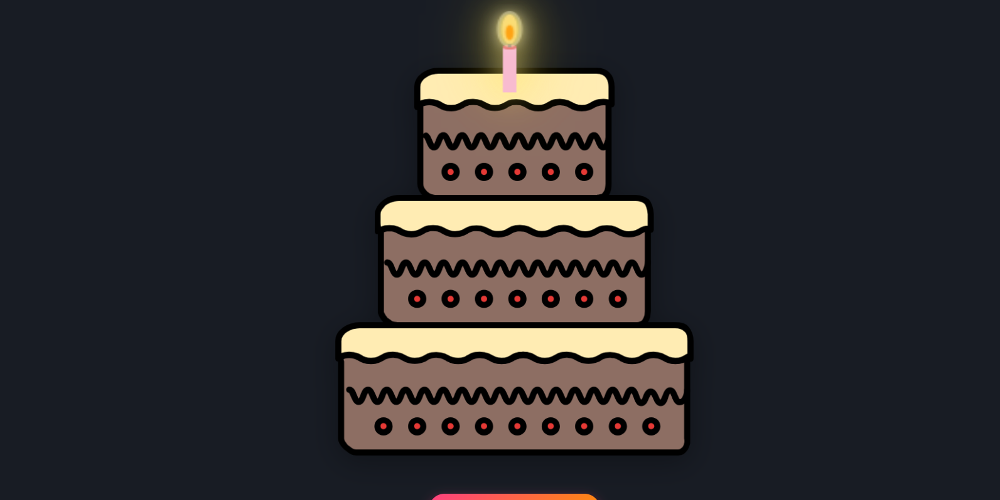
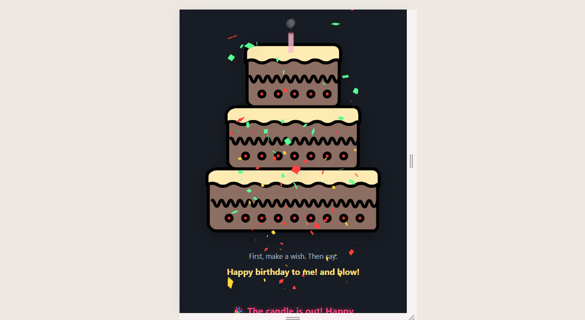
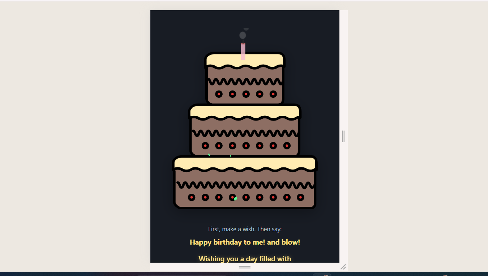

<!--that's 😎 your birthday?-->
<p align="center">
  
  
  
  
  
  
</p>

---


# 🎂 Interactive Birthday Cake - Voice-Controlled Celebration Web App🕯️🥰

A delightful web experience where users can virtually blow out candles using voice commands, accompanied by music, animations, and confetti explosions. Perfect for remote birthday celebrations!

🌐 **Live Demo**: [Celebrate Now 🕯️🎂😍→](https://birthday-kohl-nine.vercel.app/)

[](https://birthday-kohl-nine.vercel.app/)

---

## ✨ Magical Features

| Feature          | Description                                                                 |
|------------------|-----------------------------------------------------------------------------|
| 🎙️ **Voice Control**  | Say "blow!" to extinguish candles (Web Speech API)                          |
| 🎼 **Dynamic Audio**  | Plays "Happy Birthday" song with realistic blowing sound effects            |
| ✨ **Visual Effects** | Lottie animations, particle confetti, and smooth candle glow transitions    |
| 📱 **Responsive**     | Fully functional on mobile, tablet, and desktop devices                     |
| 🎨 **Customizable**   | Easily edit the personal message and cake design in the config file         |

---

## 🛠️ Tech Stack

**Core Technologies**
- Frontend: HTML5, CSS3, Vanilla JavaScript (ES6+)
- Animations: Lottie Web, Canvas API
- Voice Recognition: Web Speech API
- Hosting: Vercel (Edge Network)

**Performance**
- 🚀 95+ Lighthouse Score
- 🌐 Progressive Web App (PWA) Ready
- 📦 Lightweight (Under 1MB total assets)

---

## 📸 Interactive Gallery

<div align="center">
  
   
  
</div>

---

## 🚀 Quick Start (For Developers)

```bash
git clone https://github.com/VIDAKHOSHPEY22/Birthday-Cake-Blow-Candle.git
cd Birthday-Cake-Blow-Candle

```
---
## 📦 Birthday-Cake-Blow-Candle

``` text

📦 Birthday-Cake-Blow-Candle
├── 📂 audio
│   └── 🎵 birthday.mp3          # Birthday music track
├── 📂 css                       # Stylesheets directory
├── 📂 img
│   ├── 🎂 cake.png              # Main cake image
│   ├── 📸 preview.png           # Screenshot 1
│   ├── 📸 preview1.png          # Screenshot 2
│   ├── 📸 preview2.png          # Screenshot 3
│   ├── 📸 preview3.png          # Screenshot 4
│   └── 📸 preview4.png          # Screenshot 5
├── 📂 js
│   └── 🕯️ candle_on_cake.js    # Main interactive script
├── 📄 googlea4377f019e81adff.html # Google verification
├── 📄 index.html                # Main entry point
├── 📄 LICENCE                   # License file
└── 📄 README.md                 # Project documentation
```
---

# 👩‍💻 About Me  

Hi! I'm **Vida**, a passionate developer from Iran.  
I enjoy creating fun, interactive projects where creativity meets code.  

This project was crafted with care — feel free to fork, suggest improvements, or contribute!  

## 📫 Let's Connect  
- ✉️ Email: [vviiddaa2@gmail.com](mailto:vviiddaa2@gmail.com)  
- 💬 Telegram: [@Vida_twin](https://t.me/Vida_twin)  
- 🔗 GitHub: [VIDAKHOSHPEY22](https://github.com/VIDAKHOSHPEY22)  

## 📜 License  
MIT License - see [LICENSE](./LICENSE) for details.  


